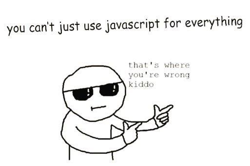

# Thoughts on Javascript



Is javascript a good language? It is hard for me to compare it to other languages that I've tried since I have only a little bit of experience programming in anything else, but personally I enjoy javascript a lot more than languages like C, C++, and Java. To me, javascript is fun and easy to use. When using statically typed languages I always feel like things are overly complicated. Simple things like making a function can cause annoyances. Javascript functions are simple and intuitive. I enjoy the fact that I don't have to state a variables type when creating a new variable. It feels flexible and fast. Personally I enjoy dynamically typed languages compared to statically typed ones. Thanks to the popularity of javascript, it's also easy to find solutions to problems you may have when programming. I also enjoyed using Lua and Python, though I don't have as much experience using those two than javascript. I am still somewhat new to using ES6. Arrow function seem straight forward, but I still get confused when using them with something like .map().

One thing I feel is kind of confusing is how javascript is always changing.  For example the way to create functions has changed so now instead of this...
```javascript
function name(param){
  statement
}

// or

let name = function(param){
  statement
}
```
... you can also do this.
```javascript
let name = (param) =>{
  statement
}
```
It is a bit hard to keep up with the changes sometimes.


# Javascript for Web Apps
A while ago I had tried to make a web application using javascript and a library called <a href='https://reactjs.org/'>React</a>.  After a bit of time learning, I was creating components and writing javascript code.  But soon I learned of another library/framework.  I wondered if I should switch over to that instead of wasting my time with react.  Soon after that I learned of another library/framework.  It seems to me that in the world of web development, frameworks and libraries come out faster than you can become proficient in them.  These tools use javascript in different ways and it gets hard to keep up.  Sometimes it feels like a completely different language.  

# Athletic Software Engineering
I'm a person who learns best by doing the work. I love the concept of "Athletic Software Engineering" because it seems like something that will help me become a better programmer. I admit that I'm not the best programmer. I over think things which causes me to work very slowly or approach the problem in the wrong direction. The WODs so far have shown me that I still have a long way to go. I know I am able to complete these WODs on time, however I make mistakes that cause me to slow down. I hope that as I do more problems, I am able to fix my mistakes and become a better programmer overall. 
