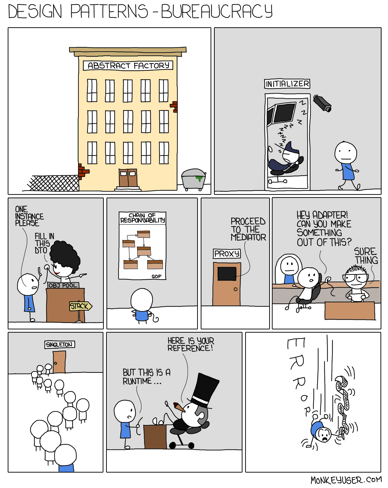

# Coders Remorse

When working on large projects it's easy to eventually get to a point where your code is a mess and you think to yourself "I should have done it *this* way instead".  Personally, this has happened to me many times, and continues to happen to this day.  Usually this causes me to restart or rewrite the project I've been working on, but even after restarting I end up thinking the same thing.  I regularly think that something in my code could have been done another way to make things easier.  However, I don't think that explaining design patterns is easy especially to someone who has never experienced one.  It's something that you have to experience in order to see the importance. 

  

When working with a team, you'll find that everyone codes differently with their own design pattern.  It soon becomes a mess and you begin thinking, again, that "I should have done it *this* way instead".  It would probably have been helpful to explain to your team that your project will be done using *this* design pattern.  That way everyone will be more in sync when it comes to coding.  Just think about all the time wasted trying to figure out another teammates code.  How does everything connect to each other?  Why did they write this piece of code like this?  All these questions could be answered by following a design pattern.      

# Learn by Experience
You might have been using a design pattern without noticing.  There are times when you might even create your own.  I remember when I first started learning game development I knew nothing about design patterns.  As I said before, there were many times when I just restarted because I realized that things could be a lot better if I had just done something a certain way.  I developed design patterns when trying to develop games.  In my puzzle game ([as seen in my projects page](https://dkihe.github.io/projects/tetrisattack)), I had a design pattern where the play area created and controlled the block objects and player cursor position using a 2D array.  The play area array would keep track of pretty much everything that occured inside including block position, block color, cursor position, and most importantly it would check wether blocks matched.  Many times when I make games, I would need an object that controls things like player score or something that spawns enemies.  There are probably names for these patterns I used, but I'm not really the type of person who can read a book and memorize a bunch of patterns.

If you were to ask me to define design patterns, I would say that it is a way of organizing your code that saves you a lot time and hassle.  It's something that I feel is very important to learn when it comes to computer engineering, especially since design patterns are very helpful when it comes to real life situations.  
