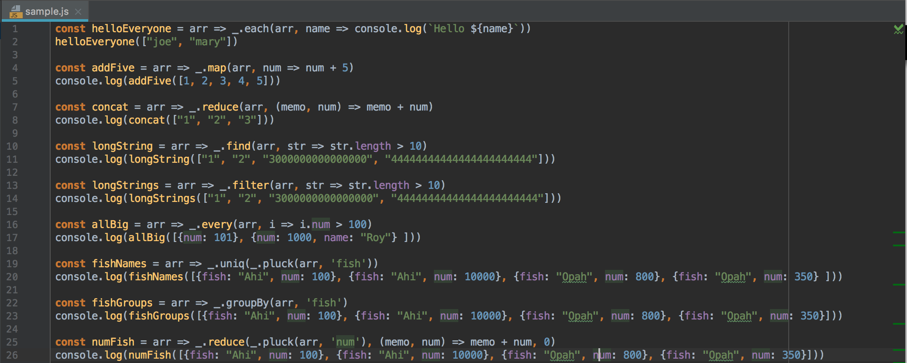
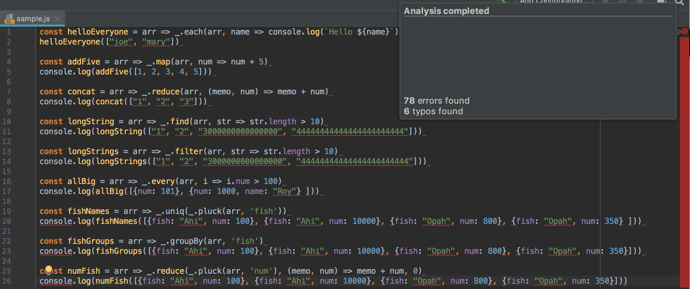

# Me Against ESLint

Recently I started using IntelliJ IDEA with ESLint.  ESLint is a tool that is used by developers to help catch code that does not adhere to certain standards.  Basically it is used to make your code cleaner.  To be honest, ESLint has been more of an annoyance than helpful to me.  ESLint makes my code look like a bloody corpse.  My entire page underlined in red because I didn't put a semi-colon somewhere, or because I didn't add a space somewhere.  Look at the picture below and tell me what's wrong.

  

Some of you might tell me I forgot the semi-colons (who cares).  The code looks perfectly fine right?  IntelliJ gave me a few typo warnings probably because IntelliJ isn't Hawaiian.  Now look what happens when I introduce ESLint.

  

It looks like IntelliJ got shot in the head.  Look at that nice bloody red streak on the right with no breaks.  Let's take a look at some errors.

  

ESLint is telling me that I can't use double quotes.  You can already see how stingy ESLint is.  Part of coding standards and code quality is to conform to some sort of pattern.  This is fine with me anyway since I don't usually use double quotes and I think single quotes look cleaner.  There are a lot of quotes though.  To fix this I can use `CMD + R` to replace all double quotes.  Let's fix another error.

  

The maximum line length is 120 characters?  What am I supposed to do then?  Well, the lines used could be added to a single array.  I guess the idea is that long lines are hard to read.  I can fix this by creating a new constant to hold the array so that the code isn't hard to read.

  

ESLint says that I need a space before and after a curly brace.  I also can't have a space before or after a bracket unless it's after a declaration.  Again, this all so that it is easier to read.  After fixing this error I get...

  

This is why ESLint is annoying.  What if I have a huge array?  I can't ever use it?  Technically I can just use it.  What's ESLint going to do, give me an error?  I still need to get this stinking check mark so I'm just going to have to cut some of this arrays fat.

The final error asks that I add semi-colons to the end of each line.  When I code in javascript I never use a semi-colon.  It's not needed, and I personally think it makes my code look less clean.  Doing this gets rid of all the errors except for one.

  

Am I being punked?  How this is useful?

# I Finally Got the Checkmark

  

Here is the completed code and the check mark.  It looks different because I put an array at the top and also I added a bunch of semi-colons.  In all seriousness though, I do think that coding standards are important and I would like to change the way I code so that it conforms to ESLint's standards.  I agree with the majority of the errors except the semi-colon one (useless and ugly) and also the 120 character limit on lines (at least when it comes to large arrays).

