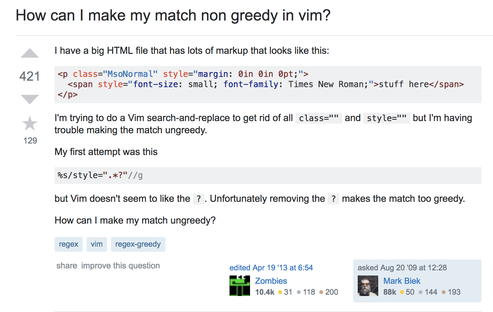
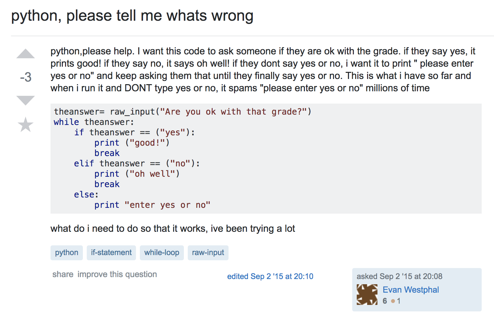

While working on your app, you come across a problem.  Maybe you need to fix a bug, or maybe your program keeps giving you an error.  So what do you do?  There are several things you might have done.  As a programmer, 'Google' is your best friend.  If you had an error message you might have copy and pasted the message into google.  If you had a bug, you might have tried to use google to find the answer.  If both your attempts failed, then it's time to give up.  After mustering up that last sliver of hope and motivation that you thought had disappeared you might come up with one more way to save your app. There are millions of programmers out there you might have had the same problem as you.  You realize that alone you are weak, but together are strong.  You can ask for help on a forum like <a href='https://stackoverflow.com/'>Stack Overflow</a>.  But wait!  Don't just go on the forums and post question like it's no big deal.  

# The Smart Question
There are two types of people in this world.  The first asks questions in a 'smart' way.

  

In this example the user asked their question and gives a very detailed description of their problem.  Their description includes what they are trying to acheive and their current code.  They also show what they have tried before and what happened when they tried it.  This question was viewed over 97,000 times and gained many favorites and votes.  This question most likely helped many with the same problem. 

<a href='https://stackoverflow.com/questions/1305853/how-can-i-make-my-match-non-greedy-in-vim'>Link to the question</a>

# The Lazy Question
The second type of person asks questions in a 'lazy' way.  

  

In this example, the user asks a lazy question.  Their title gives no indication as to what the problem is besides that it's in python.  There's no effort to be clear or grammatically correct and they type as if they're in a chat room.  There's a lot of grovelling and it they seem be giving instructions for what they want so that someone can do the coding for them.  This question also seems to be a homework problem.  The question was downvoted into the negatives and was barely viewed in the 3 years since it was posted.  This tells me that the question was not very helpful to other users.  

<a href='https://stackoverflow.com/questions/32362197/python-please-tell-me-whats-wrong'>Link to the question</a>

What kind of person are you?
