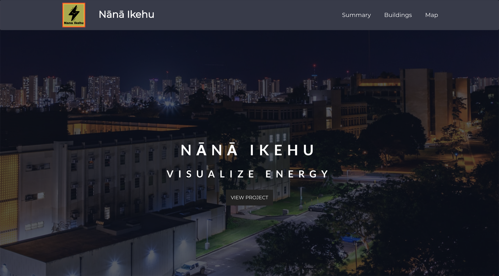
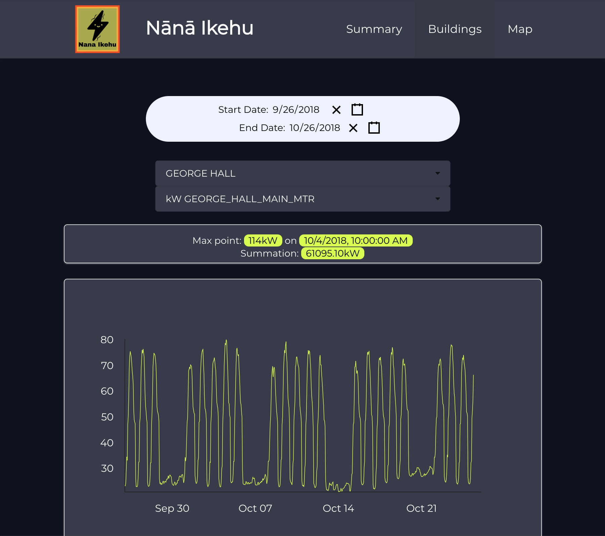
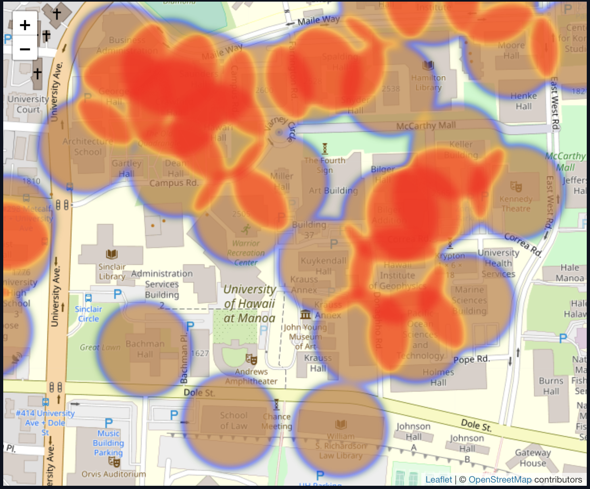

  

*Nana Ikehu* is an application that my team and I created for the Hawaii Annual Code Challenge (HACC).  We decided to take on the challenge of tracking energy trends on the University of Hawaii campus in the hopes of lowering the amount of energy used on campus.  Currently, UH Manoa spends $30 million dollars a year on electricity.  The Office of Energy Management at UH Manoa's goal is to increase energy efficiency by 30% by the year 2030 and by the year 2035 UH Manoa aims to reach Net Zero Energy.  

*Nana Ikehu* is an application that is used to analyze power usage data throughout the University of Hawaii campus.  Users are able to view data through the use of graphs and maps.  The data displayed on our website include things like the different buildings on campus, the different meters used for each building, and the energy usage for each building.  Our app includes a date picker that allows users to select a date range to show the data.  The graph will display data within the selected range.  Users may choose buildings either by selecting a building through a dropdown list or by selecting a building through a campus map.  We've also included a heat-map which highlights which buildings use the most amount of energy.  After selecting a building, our graphs show data such as the average amount of energy used during the dates chosen and the time at which the most energy was used.

  

There were many challenges that we faced during the production of our app.  *Nana Ikehu* was created using Meteor and React.  Our main issue was properly displaying data onto our graphs.  The majority of us did not understand backend development as much as frontend development.  For me personally, it was my first time working with Meteor and learning backend development.  We also ran into issues when it came to communication.  Initially, we did not open issues on GitHub.  This led to a lot of wasted time since some of us worked on the same issue without really knowing it until we met in person.  At that point, we would discard code from one person in favor of another because their code worked much better.  Our biggest issue was the deployment of our site.  When deploying our site, our data did not seem to appear.  We spent many nights struggling to find the reason for our data's disappearance.  It was confusing to us because our site worked perfectly on our own localhosts, but when deploying everything seemed to disappear.  Eventually, we were able to display some data on our deployed site, but not all.

  

As students, we had to manage our time well in order to finish our project by the deadline given to us.  During the development of *Nana Ikehu* I learned a lot about what it's like to work as a team.  I was always interested in learning backend, and this project gave me the perfect opportunity to learn how to use databases.  For this project I contributed mostly to the frontend, including the landing page and some of the graphs.  

[Nana Ikehu Homepage](https://nanaikehu.github.io/)         
[Nana Ikehu GitHub](https://github.com/nanaikehu/Nana-Ikehu)        
[Nana Ikehu App](http://nanaikehu1.meteorapp.com/#/)  
