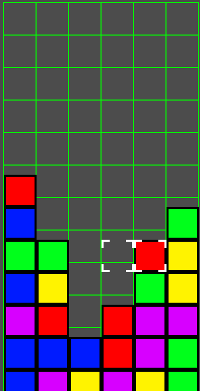
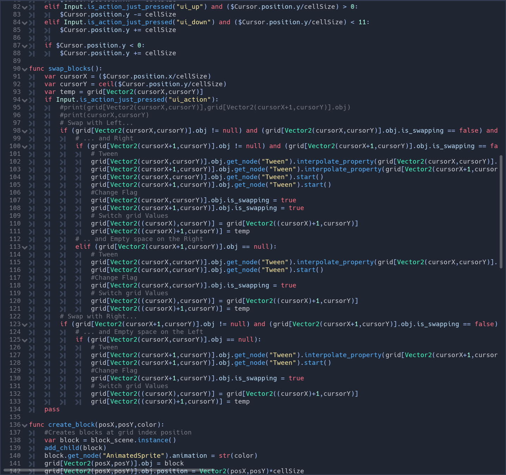

Tetris Attack is a puzzle game for the SNES.  It was also known as 'Panel de Pon' in Japan and also goes by the name of 'Puzzle League' or 'Puzzle Challenge'.  The player controls a cursor which switches the position of two blocks.  Matching 3 or more blocks of the same color destroys the blocks and sends garbage blocks to the other player in competitive play.  The player loses once their blocks reach the top of the play area. 

This project was created using a game engine called Godot.  Godot uses it's own language that is very similar to python called GDScript.  

 
The future of the Puzzle Challenge series is not clear.  Recently it was featured as a small mini-game in the 'Animal Crossing' series.  As a fan of the series, I decided to try and make my own clone of it.  It was hard to find any kind of help in making this clone because the series is not very popular.  I learned a lot about game development and the work that goes into creating a game.  

Currently the game is still unfinished.  The only things implemented are the swapping of blocks, rising random blocks, and gravity.  Things like destroying blocks after they match, a losing condition, and other things are still missing.  
