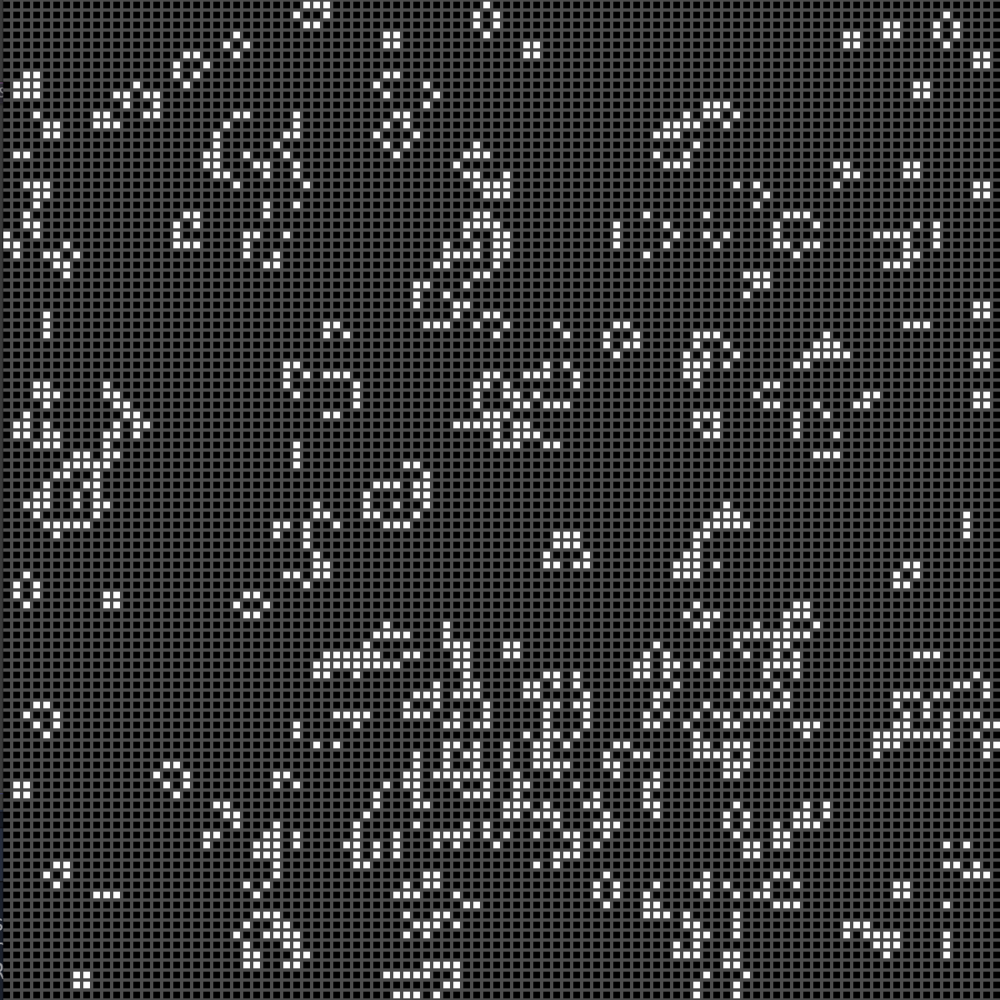

This project was a done while following a tutorial at [Brainjar Games](http://www.brainjargames.com/game-of-life/). After following this tutorial I was able to learn more about grid based develepment.  The skills I learned in this tutorial helped me develop other games such as my [Tetris Attack clone](https://dkihe.github.io/projects/tetrisattack).

The rules of the game are:
  1. Any live cell with fewer than two live neighbours dies, as if caused by underpopulation.
  2. Any live cell with two or three live neighbours lives on to the next generation.
  3. Any live cell with more than three live neighbours dies, as if by overpopulation.
  4. Any dead cell with exactly three live neighbours becomes a live cell, as if by reproduction.

Making this game also taught me more about computer science topics such as the concepts of cellular automatons and turing machines.  It was also easy to modify the game to include more cells and different intial spawning rates.  I found that increasing the cell count produced interesting results.  The picture below shows a game with a size of 100 x 100.  

